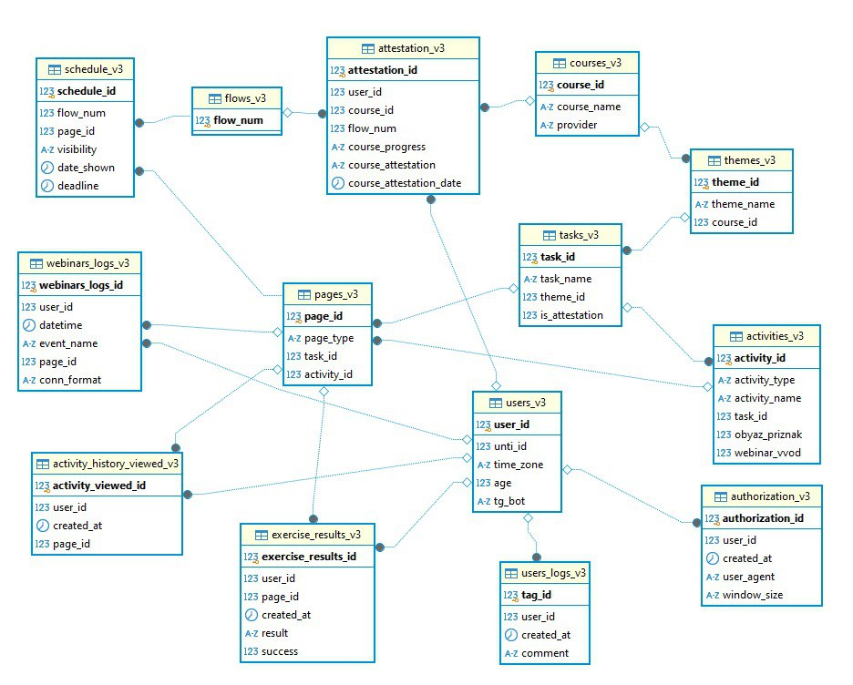

# Схема базы данных

# Заполнение
Для заполнения таблиц первыми данными можно использовать следующий скрипт [Script_fill_bd_gavrilova_1.sql](./sqls/Script_fill_bd_gavrilova_1.sql)

# Исходный датасет
На базе этих таблиц работает следующий скрипт. Он формирует необходимый датасет [Script_ds_gavrilova.sql](./sqls/Script_ds_gavrilova.sql)

Необходимо разархивировать в начале строку очистки данных и в конце строки insert со столбцами

# Заполнение таблиц
Далее для заполнения таблиц вторыми данными работает следующий скрипт (первые данные очищаются) [Script_fill_bd_gavrilova_2.sql](./sqls/Script_fill_bd_gavrilova_2.sql)

На базе этого скрипта можно очищать таблицы и заполнять новыми полученными данными для будущих стажеров

# Данные в датасет
Далее снова используется [Script_ds_gavrilova.sql](./sqls/Script_ds_gavrilova.sql) скрипт для добавления данных к датасету, но строку очистки в начале раскомментировать не надо, а строку с insert в конце надо

# Итоговая таблица
В итоге получилась табличка `ds_gavrilova`, на базе которой я делала модели. Вот документ
[2024_12_08_Edutech_models.ipynb](./ipynbs/2024_12_08_Edutech_models.ipynb) [2024_12_08_Edutech_models.py](./ipynbs/2024_12_08_Edutech_models.py)

# Модели
И сами модели, которые определяют кластер на текущий момент времени и прогнозируют вероятность успешного завершения курса соответственно

* [current_cluster_model.pk](./models/current_cluster_model.zip)
* [successful_attestation_probability_model.zip](./models/successful_attestation_probability_model.pk)